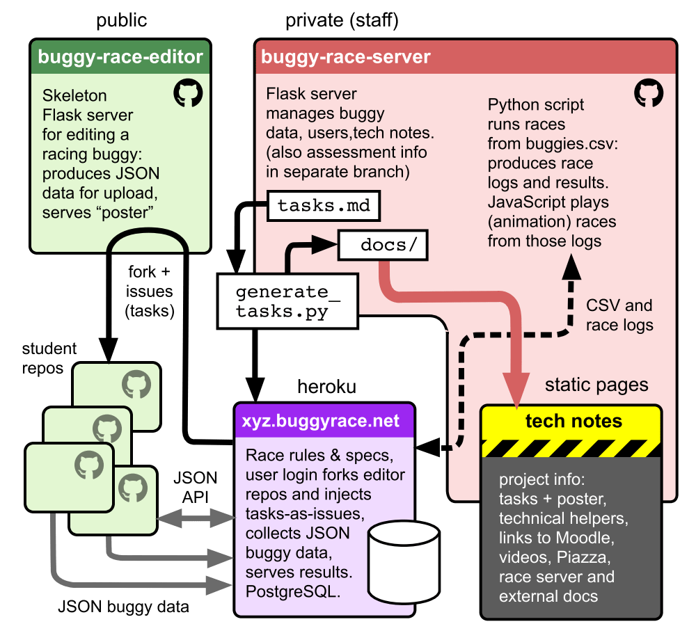

# CS1999-buggy-race-server

This is the central (staff, private) repo in the CS1999 Foundation Year "Buggy
Racing" project.

## About the project

The project requires students to develop a Python Flask web app that lets them
edit a [racing buggy](https://rhul.buggyrace.net/specs/). It produces JSON data
describing the buggy which they can upload to the central race server. Races
happen every night; the results are irrelevant to the student's success — they
are marked on the quality of the editor they have built.

We provide the skeleton of their editor
([buggy-race-editor](https://github.com/RHUL-CS-Projects/CS1999-buggy-race-editor))
and a **set of tasks** for them to complete. How thoroughly they complete
the tasks is up to them, but the tasks are grouped in phases, and they _must_
complete the phases in the given order. The final task (phase 6) is completely
wild-carded (_do anything_), but most of the tasks are actually open-ended.

### Structure of the project software

There are three repos:

* [buggy-race-server](https://github.com/RHUL-CS-Projects/CS1999-buggy-race-server) (this repo)

  Contains a Flask web app that accepts students' racing buggy specifications
  as JSON data, manages login/setup, and publishes information both on the
  server itself (racing specs) and as GitHub pages (the "tech notes").

* [buggy-race-editor](https://github.com/RHUL-CS-Projects/CS1999-buggy-race-editor)

   Contains the skeleton Flask web app that runs the Racing Buggy editor that
   every student is given, and which they must develop according to the tasks.

* [buggy-race-runner](https://github.com/RHUL-CS-Projects/CS1999-buggy-race-runner)

  Contains a script that accepts the (usually nightly) `buggies.csv` data from
  the race server and actually runs the race, producing results and race logs.
  Also JavaScript for replaying a race in a browser (when this is done it'll
  probably be integrated into the main server).

### About the tasks

The tasks in `project/tasks.md` are definitive for the project. That file
is parsed by `utils/generate_tasks.py`.

Every task has an ID comprising its phase number and a mnemonic name. For
example, `3-MULTI` is the phase three task for adding multiple buggies to the
editor (initially it's configured to edit a single buggy).

Once the project has started (that is, students have been given the tasks)
do not materially change `tasks.md`, because this may affect URLs as well as
published material. (Fixing typos may be necessary, but do not change task IDs).

`utils/generate_tasks.py` currently updates three files:

* the task list in `docs/projects/tasks.md` which is published on the 
  [GitHub pages site](https://info-rhul.buggyrace.net/project/tasks)
* the project's 
  ["poster" template page](https://info-rhul.buggyrace.net/project/poster)
* a file, `issues.csv` which is used to automatically inject these tasks as
  GitHub issues when the student's editor repo is forked

Each task has a unique URL so it can always be referenced directly: the race
server redirects `/project/task/<task-id>` to the GitHub pages site (e.g.,
`0-GET`) — use this if the GitHub pages URLs are too cumbersome.

### About _this_ repo (buggy-race-server)

The five main things in this repo:

* the **definitive** list of tasks students are invited to tackle

* the `docs/` directory is published as GitHub pages with a custom (CNAMEd) subdomain at
  [info-rhul.buggyrace.net/](https://info-rhul.buggyrace.net/) (for development work, you can run this
  locally if you install Jekyll)

* the `main` branch is deployed at Heroku (currently via Dave Whiteland's
  heroku account) at [rhul.buggyrace.net](https://rhul.buggyrace.net).
  See `env.example` for settings (which on Heroku are set via the
  config/environment variable web interface)

* the `utils/` directory contains `generate_tasks.py` (and maybe one day other
  tools)

* the `assessment` branch contains assessment information — see notes below.

### About the race server

The race sever in this repo (deployed live on Heroku) is a Flask app that
connects to a PostgreSQL database in the production environment. (If you run
it in development, it's happy with SQLite).

At the start of term, you need to load it with student (and staff) login
accounts. You can register yourself by providing the authorisation code (which
you can set as `REGISTRATION_AUTH_CODE`). Likewise, grant yourself admin
access by including your user name in `ADMIN_USERNAMES` (see `env.example`).

When registering, emails are _optional_ — you just need a username and password
(we used emails as the usernames last year, and it was unnecessarily complex).

Once you have admin access up on the server,  you can use the bulk registration
feature to add students.

Give the students their passwords individually (see task 8 below: there's a
utility to help with this). When they log in, they will be invited to log into
their GitHub account. The server then forks the editor repo into their account,
and also injects the tasks as GitHub issues into that repo. (They do not have
to use these issues, but they can).

As the project progresses, students can log into the server and enter the
specification of the racing buggy they want to enter in the next race: this is 
JSON data ideally produced by their editor. Data entry is initially simply
copy-and-pasted into the server's web form, but later students might implement
the API instead.
  
Races are _not_ run automatically. A human admin needs to download the
`buggies.csv` from the server, run the race, and upload the results. Currently
this is delegated to `buggy-race-runner` and _is not yet implemented_.

### rhul.buggyrace.net & info-rhul.buggyrace.net

Domain registration & heroku accounts: currently Dave Whiteland.
The GitHub app client (needed for the client ID and secret needed to allow
use of the GitHub API for forking into students' accounts) registered under
Dave's GitHub account (organisations cannot do this; must be an individual).

The domain is registered by Dave too, and has the two subdomains (one
for the race server on Heroku and one for the GitHub pages (`docs/`) site).

## Installation

The server is a Python3 Flask app generated from
[cookiecutter-flask](https://github.com/cookiecutter-flask/cookiecutter-flask)
(CookieCutter-Flask may have been a bad idea because it's resulted in inherited
complexity, sorry).

See `INSTALL.md`

## Generating the Tech  Notes

The tech notes are a GitHub pages site (via Jekyll), published from the `/docs`
directory.

However, the project task list (which appears as
[info-rhul.buggyrace.net/project/tasks](https://info-rhul.buggyrace.net/project/tasks))
is generated from `/project/tasks.md` (careful! **not** in the `/docs`
directory — don't edit that one!).
To change that, edit the tasks file and run `/utils/generate_tasks.py` to create
the (CSS styled) version that gets published. This not only takes care of the
fancy-pantsy (CSS class) styling, but perhaps crucially it keeps the
`issues.csv` file in synch.

> Students don't _need_ to use GitHub issues (or indeed, version control) —
> but those who do should be encouraged by having the tasks as issues. That's
> why we've separated the tasks out in this manner: it's crucial that the
> issues' text matches what is specified on the published site. You really
> must not change them once the project has started!

## Assessment & rubrics

Assessment information is in `assessment.md` in the `assessment` branch.

This is a separate branch so assessment information isn't deployed on the
heroku server, for example. It's not a security issue, but to minimise risk of
accidental publication :-)

## Set-up process for a new year

Informal steps for setting up the project:

> For 2021 there was extra work because we changed the 
> [editor code](https://github.com/RHUL-CS-Projects/CS1999-buggy-race-editor),
> so needed to re-record all the videos and update tech-notes. That won't
> always be necessary!

0. Tech set-up: make sure the server is running

   * check GitHub pages (on this repo) is published OK 
   * check the server is running (e.g., deployed on Heroku)
   * set up the database or make sure it's empty if carrying over from previous year
   * make sure all the config is set, including external URLs: see `env.example`
    — that includes the `REGISTRATION_AUTH_CODE` code you'll need to set up
    administrators

1. Go onto the server and
  [register your own user](https://rhul.buggyrace.net/register) —
  make yourself an admin by adding your username to the `ADMIN_USERNAMES`
  config
  
2. create list of student usernames and allocate passwords

   For 2021 I took first names where possible from the enrolled student
   list on the Moodle, and associated passwords (use a simple password
   generator like [dinopass](https://www.dinopass.com)).

3. Use the [bulk registration](https://rhul.buggyrace.net/admin/bulk-register/)
   feature on the server to add them — warning: that's so poorly implemented
   it's best to do it in batches of no more than 10 (see issue #32)

4. Check the task list is correct (because you can't easily change it once
   the project starts): `project/tasks.md`

5. Run `generate-tasks.py` which updates `docs/` (you'll need to commit those
   changes). Remember to commit the issue list (`issues.csv`) too, because the
   server reads it when injecting the issues into students' GitHub repos.

6. If you're encouraging use of [repl.it](https://replit.com)
   (as a catch-all for students who can't run on their own machines) set that
   up with the most recent code _before_ you start.
   
7. If you've had "not ready yet" warnings up on the GitHub pages site (that
   was `docs/_includes/announce.html` in 2021) remove those

8. Individually tell each student their password

   In 2021 we're using Moodle's ability to absorb a spreadsheet and distribute
   individual feedback to students privately: by setting up a zero-submission
   _assignment_ on the moodle, you can upload "feedback" to individual students.
   So there's a Python script (`utils/moodle-login-csv.py`) that takes the
   Grading spreadsheet downloaded form the Moodle, combines it with a
   username/password combo keyed on email (see 2. above, tweaked) and writes
   a personalised message as feedback. See extensive comments at the top of
   that `moodle-login-csv.py`. The second spreadie is a bit klunky so this
   could be refined!

9. Check links to Moodle

   The URL for the moodle page changes every year and there are a couple of
   place where it's set:
   
     * up on the server there's an environment variable called `MOODLE_URL`
       (go onto Heroku and find settings → reveal config vars)
     * the GitHub pages files also have a varibale: see `moodle_url` in
       the [`_config.yml`](https://github.com/RHUL-CS-Projects/CS1999-buggy-race-server/blob/main/docs/_config.yml)

10. manually (yes) run races

   Once you're running, students can and will upload their buggies to the
   server at any time — in theory, you can run a race by logging in (as admin)
   and downloading `buggies.csv`, running the race (see
   [buggy-race-runner](https://github.com/RHUL-CS-Projects/CS1999-buggy-race-runner))
   and uploading the results (all this is a bit arm-waving because it's not
   implemented yet — in 2020 we, uh, _did not run any races_ due to time
   pressures). Race results aren't crucial to the project at the very start,
   but task 5-RACELOG currently anticipates them being there.

## History

This project was first run for the CS1999 (CompSci Foundation year at RHUL)
in term 3, 2020.

