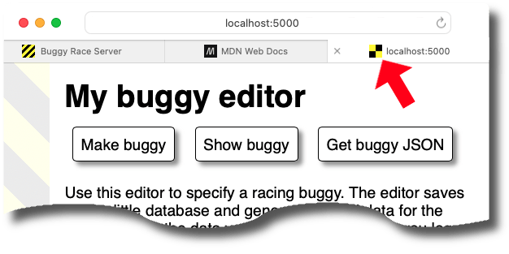

Title: about favicons


# About favicons

The buggy editor's source code includes an unusual route that responds to the
request by sending back a file called `favicon.png`. This tech note explains
what it's doing and why it's there.

The `favicon.png` file in your editor is a relatively small PNG image that
contains a yellow-and-black square:


## What is a favicon?

A favicon is a "favourite icon" or shortcut icon that isn't itself displayed 
within the web page. Instead it's a small icon that the browser can use to
differentiate this site (or, more accurately, this webpage) from others. Your
browser may use it to put on the tab, or (if you bookmark the URL) in the
bookmark list.



## Why requests for favicons are slightly unusual

When you're developing your buggy editor, [requests](flask-webserver) are
usually triggered by one of two things:

* you entered a URL or clicked a link to send a request
* a page you loaded required additional resources (such as a CSS or images)
  whose URLs are explicitly stated in the HTML (often relative to the domain
  and route of the page)

But favicons are different because they _can_ be implicit: that is, when you
load a resource from a domain, your browser might make a request for a favicon
from the _root_ location (so,`/favicon.ico`). This behaviour is
browser-dependant, but the key thing is that most browsers will make this
request even though neither you nor the resource it loaded explicitly asked for
it.

This behaviour can be overridden if the resource the browser loaded is an
HTML page that _explicitly_ nominates a different URL to use. You can see this
happening in the buggy editor because, in `templates/base.html` there's a `link`
tag that tells the browser what URL to use to get the favicon: 

```html
    <link rel="icon" href="/favicon.png" />
```

This line is in the HTML document's `<head>`, where you can also find
a `<link>` tag for the CSS stylesheet. So in this case, it's just like any
other resource that's explicitly included in the HTML. The subtle difference is
that if you don't put a `<link rel="stylesheet"...>` tag in your HTML then your
browser won't send a speculative request to see if it can find one. But if you
don't put a `<link rel="icon"...>` tag in, most browsers _will_ fire off a
request for `/favicon.ico` anyway.


## The buggy editor's `/favicon.png` route

This is the [route](routes-in-flask) that you can find in your buggy editor's
`app.py`:

```python
@app.route("/favicon.png")
def send_favicon():
    return send_file(
        "static/favicon.png",
        mimetype='image/png',
        max_age=60*60*24
    )
```

Unlike the other routes, this isn't using a template, and it's not reading the
database (which is what the `/json` route does). Instead, it's simply sending
back a static file. There's something odd here: that file is in the `static`
directory, which Flask already knows how to handle — Flask doesn't need to find
a route in your Python for static files. You can see this because your app is
serving the stylesheet `app.css` even though there's no route in `app.py` for
it.

The reason we've included this route is so that your buggy editor can add that
`max_age` header to its response. This is effectively telling the browser
"this icon is good to reuse for the next 24 hours"  (the value of `max_age` is
a number of seconds, so 60×60×24 is one day). It's telling the browser to
**cache** the icon.

What would happen without the `max_age`? Well, _because we encourage you to
run your buggy editor in Flask's `development` mode_, everything is usually
being sent out with no caching. (That's sometimes called a "zero time-to-live"
(TTL) policy). So without the favicon's `max_age=86400`, you'd see a `GET`
request hitting your buggy editor _every time_ you request any resource from it.
This isn't a big problem, but if you're new to web dev we think it's unhelpful
for your webserver's activity to be reporting multiple requests for something
you didn't ask for (and which isn't changing anyway). By dropping the favicon
link into the base template, putting its route into `app.py`, and caching its
response, we've made what's going on less mysterious.


## When caching is not your friend

So why isn't there also a route for the `app.css` stylesheet? That is handled
as static content (at `static/app.css`) and there's no max age/TTL being set
on that.

The difference is that, unlike the favicon, we anticipate you making multiple
changes to your CSS stylesheet as you're developing your buggy editor. It
turns out that caching is great in production — you _want_ the same files to
be reused without the overhead of waiting to download a resource you've already
got and that hasn't changed. But this is exactly what you don't want when you
_are_ changing it between requests... which is what you're doing as a developer.

It can be very confusing (and frustrating) when the changes you are making to
your HTML or CSS files are not appearing in the browser when you refresh the
page. Almost certainly this is going to bite you at some time during the
project! For more information about this, see the tech note about
[cache-busting the CSS](cache-busting-css).

Of course, you can change the favicon that your buggy editor uses! If you do so,
do you need to do anything before it will appear in your browser? To understand
more about how the webserver and the browser work this out, have a look at
[HTTP status code 304](https://developer.mozilla.org/en-US/docs/Web/HTTP/Reference/Status/304)
and [conditional requests](https://developer.mozilla.org/en-US/docs/Web/HTTP/Guides/Conditional_requests)
(especially the `If-Modified-Since` header).


## The .png format vs. .ico format

You may have noticed that your buggy editor's favicon is `favicon.png`, which
is not the same as the default `favicon.ico` that the browser would otherwise
ask for.

> By the way, you can discover this default for yourself by commenting out the
> favicon `<link>` (e.g., use `<!-- -->`) and watch your buggy editor's activity
> log when you load pages... you'll probably see `404` errors on a request for
> `/favicon.ico` that you didn't ask for. (This behaviour does depend a little bit
> on which browser you're using, but this is default for most).

We've used a [PNG format](https://en.wikipedia.org/wiki/PNG) for the buggy
editor because that's a common format for image files on the web, and if you try
to open or view `favicon.png`, then you'll probably see the yellow and black
square image shown above. The `ICO` format is more specialised and is capable of
containing many different sized icons, which — at least to start with — is more
complexity than the basic buggy editor needs. You can read more about the
[ICO format](https://en.wikipedia.org/wiki/ICO_(file_format)).


## Why do browsers assume that the icon is at `/favicon.ico`?

If you can specify a URL with `<link rel="icon"...>`, you may wonder why
browsers don't just always use that. The answer is that browsers may want to
apply a favicon to resources that are not HTML pages: for example, a `PDF`
page from a website. Your buggy editor's `/json` route is another example. So
the behaviour of requesting a favicon applies to resources other that HTML
pages, and those resources are not capable of expressing the URL of an
associated icon.

Apple devices make similar unsolicited requests for `apple-touch-icon.png`
(if you're testing your buggy editor on a Mac with the Safari browser, you might
see these requests appearing in your log).

The [history of this behaviour](https://en.wikipedia.org/wiki/Favicon#History)
dates back to Microsoft's Internet Explorer 5 web browser in 1999 — so that's
where the policy of speculatively requesting `/favicon.ico` comes from. It's an
example of a proprietary behaviour eventually being absorbed into a standard
through widespread adoption rather than collaborative design. Icons are somewhat
complicated because their use and resolution can vary considerably depending on
the client device. The HTML5 specification provides a
[`sizes` attribute](https://developer.mozilla.org/en-US/docs/Web/API/HTMLLinkElement/sizes)
within the `<link>` tag, which allows the client (browser) to choose
the most suitable one to download.
